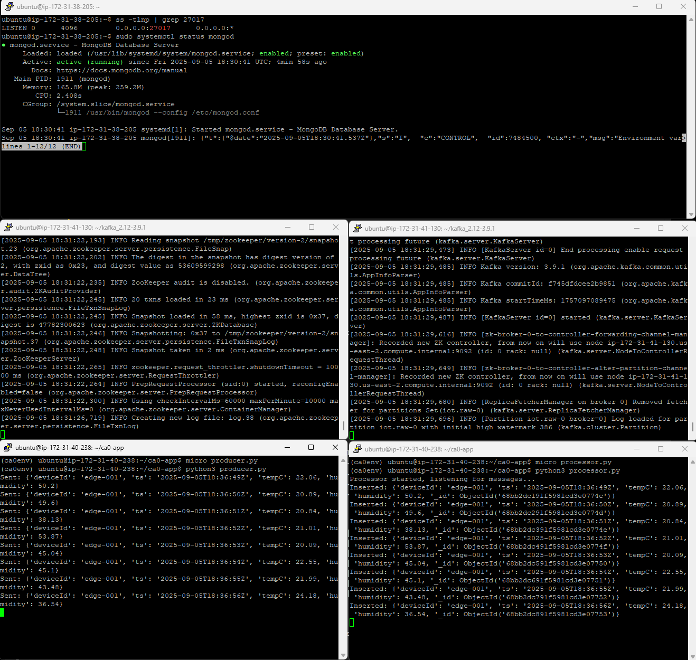
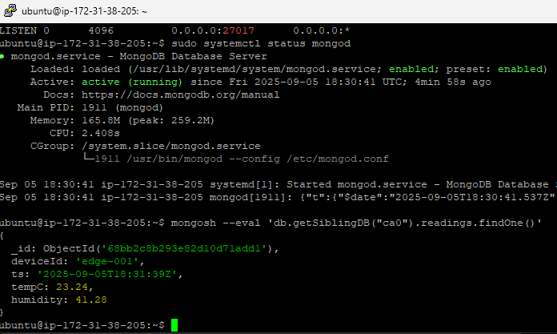
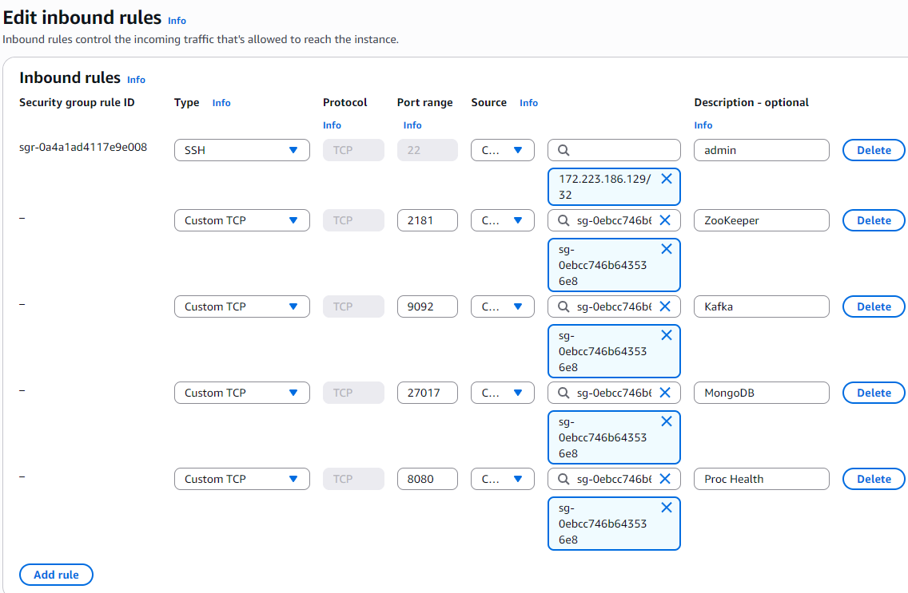
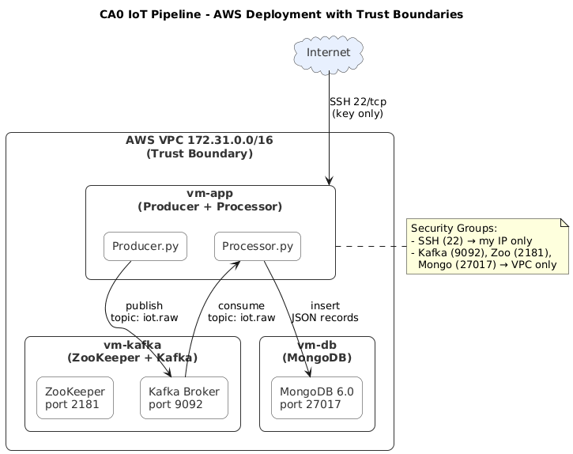

# CA0 Assignment – Manual Deployment (AWS)

## 1. Software Stack
- **Pub/Sub Hub**: Apache Kafka 3.7.0 + ZooKeeper (OpenJDK 11)
- **Database**: MongoDB 6.0
- **Runtime**: Python 3.12 + venv
- **Processor**: Python (KafkaConsumer + MongoDB writer)
- **Producer**: Python (KafkaProducer simulator)

---

## 2. Environment Provisioning
- **Cloud Provider**: AWS Free Tier
- **Region**: us-east-2c
- **VMs**:
  - `vm-kafka` (t3.micro, Ubuntu 22.04, 2 vCPU, 1 GB RAM, 8GiB)  
    Private IP: 172.31.xx.xx | Public IP: xx.xx.xx.xx
  - `vm-db` (t3.micro, Ubuntu 22.04, 2 vCPU, 1 GB RAM, 8GiB)  
    Private IP: 172.31.xx.xx | Public IP: xx.xx.xx.xx
  - `vm-app` (t3.micro, Ubuntu 22.04, 2 vCPU, 1GB RAM, 8GiB)  
    Private IP: 172.31.xx.xx | Public IP: xx.xx.xx.xx

*Note: AWS free tiers do not include 4GB of RAM thus would need to be upgraded so these VMs used what was accessible to me to not incur charges.*

---

## 3. Installation & Configuration
- Installed OpenJDK, Kafka, and ZooKeeper on `vm-kafka`.  
- Installed MongoDB on `vm-db`.  
- Installed Python 3.12 + pip + venv on `vm-app`.  
- Wrote custom `producer.py` and `processor.py`.  
- Kafka/ZooKeeper heap tuned for free-tier VMs (Kafka: 256M, ZooKeeper: 256M).  

---

## 4. Data Pipeline Wiring
- Created Kafka topic: `iot.raw`  
- Flow: Producer → Kafka/ZooKeeper → Processor → MongoDB 
- Screenshots of producer messages, processor inserts, and Mongo query. 

**Sample Mongo record:**
```json
{
"_id": ObjectId("..."),
"deviceId": "edge-001",
"ts": "2025-08-27T12:34:56Z",
"tempC": 22.4,
"humidity": 44.1
}
```
*End-to-End Pipeline*: This shows all aspects of the VMs interacting with each other, and properly logging each activity



*Sample*: The below photo shows a message from the MongoDB database after the program has executed at least once.



## 5. Security Hardening

- SSH access via AWS keypair only (`PasswordAuthentication` disabled by default).
- AWS Security Groups:
  - Port 22 open to my IP only
  - Ports 9092, 2181, 27017 restricted to VPC
- Root login disabled.


*Security Groups and port Inbound Firewall Rules*
---

## 6. Deliverables

### VM Specs

| VM Name   | Type     | vCPU | RAM   | Disk | OS           | Private IP | Public IP  |
|-----------|----------|------|-------|------|--------------|------------|------------|
| vm-kafka  | t3.micro | 1    | 914Mi | 8GB  | Ubuntu 22.04 | 172.31.x.x | xx.xx.xx.xx |
| vm-db     | t3.micro | 1    | 914Mi | 8GB  | Ubuntu 22.04 | 172.31.x.x | xx.xx.xx.xx |
| vm-app    | t3.micro | 1    | 914Mi | 8GB  | Ubuntu 22.04 | 172.31.x.x | xx.xx.xx.xx |

### Config Summary

| Component  | Version     | Host VM  | Port(s) | Notes              |
|------------|-------------|----------|---------|--------------------|
| ZooKeeper  | 3.7.0       | vm-kafka | 2181    | Internal only      |
| Kafka      | 3.7.0       | vm-kafka | 9092    | Internal only      |
| MongoDB    | 6.0         | vm-db    | 27017   | Internal only      |
| Processor  | Python 3.12 | vm-app   | —       | Consumes + writes  |
| Producer   | Python 3.12 | vm-app   | —       | Sends JSON data    |

### Network Diagram




---

## 📹 Demo Video 

Youtube link to the [demo](https://youtu.be/dc2OxgdD6NE)


  ## Replication Instructions
1. Provision 3-4 AWS EC2 instances (Ubuntu 22.04, t3.micro).  
2. Install Kafka + ZooKeeper on vm-kafka.  
3. Install MongoDB on vm-db and configure bindIp = 0.0.0.0.  
4. Install Python 3.12 venv and dependencies on vm-app.  
5. Run ZooKeeper + Kafka, then MongoDB, then producer/processor apps.  
6. Verify data insertion with Mongo queries.