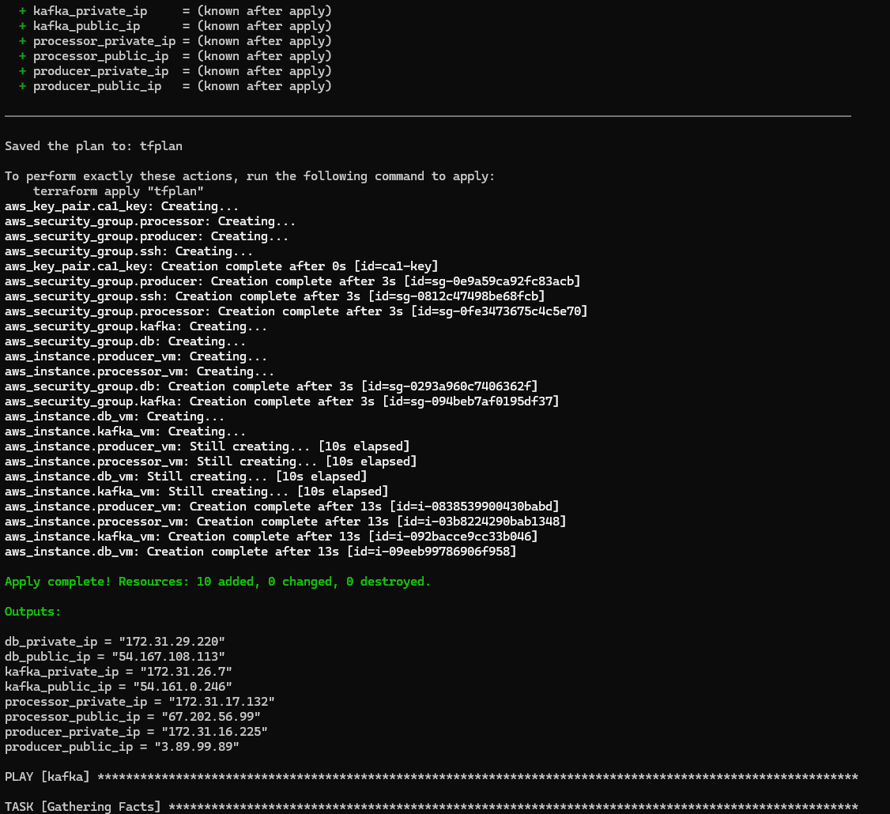
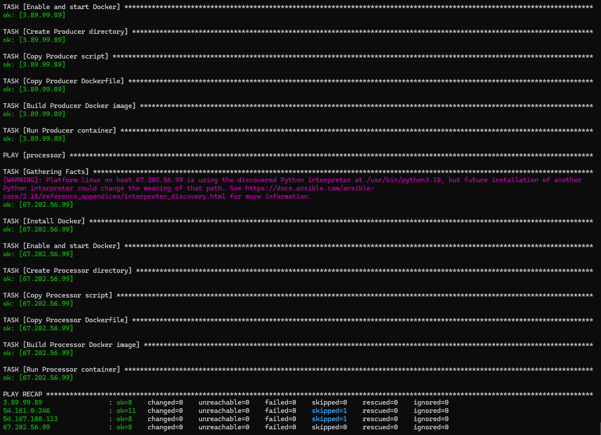
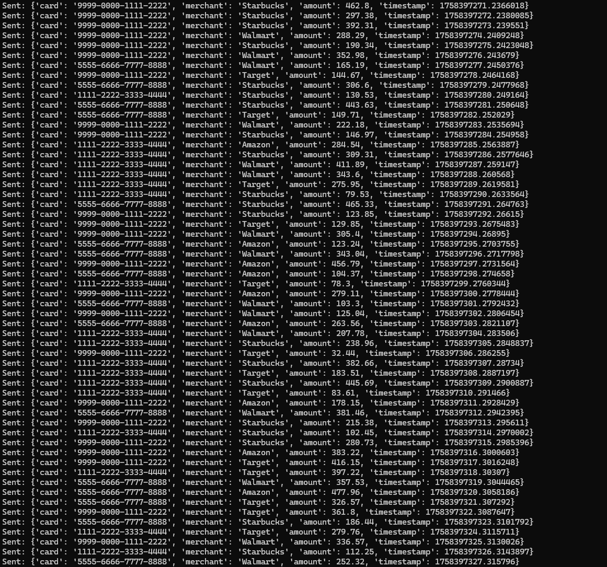
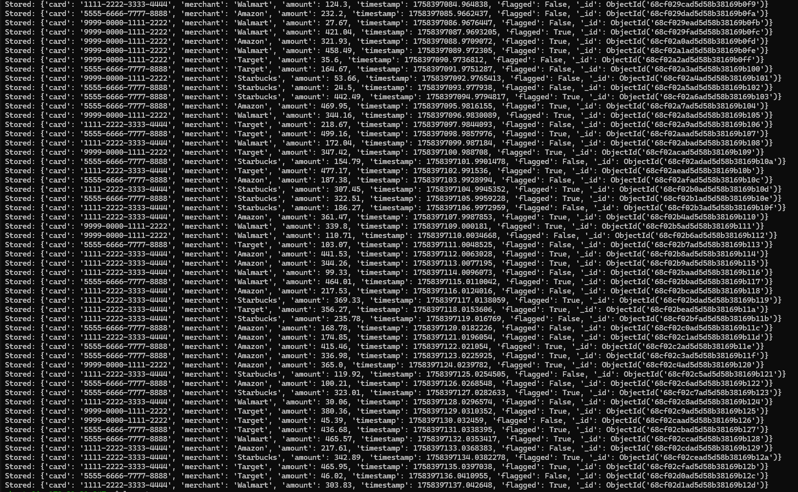
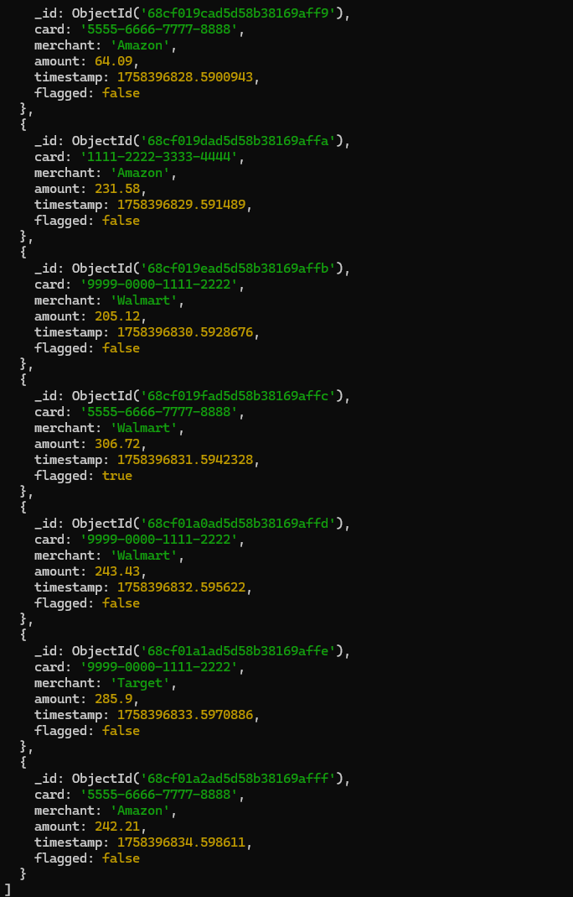
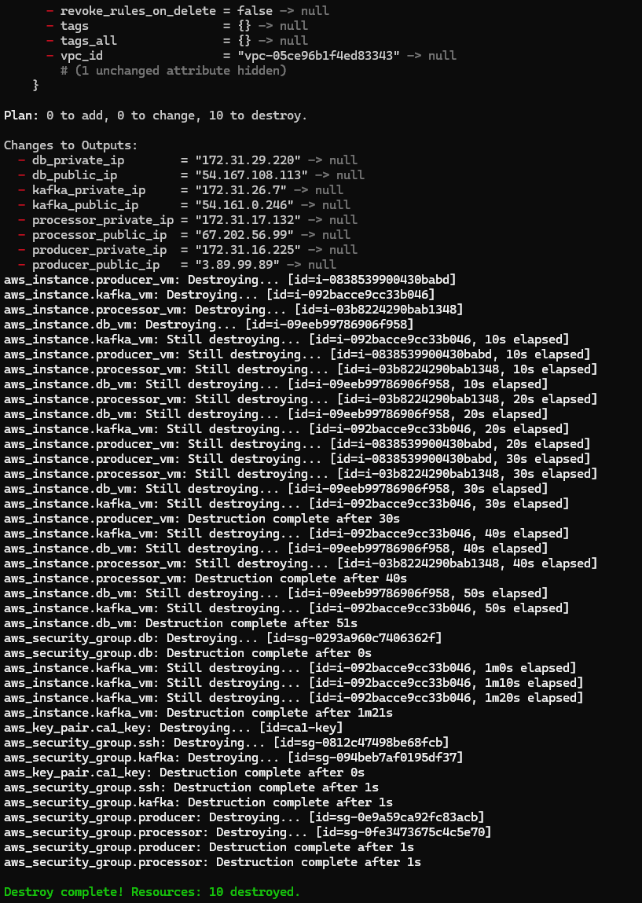

# CA1 - Infrastructure as Code (IaC)

## 🔍 Overview
This project demonstrates teh deployment of an IoT-style event pipeline using Infrastructure as Code (IaC) with Terraform and Ansible.

The deployed pipeline consists of:

- Kafka + Zookeeper: Event streaming foundation
- Producer container: Simulates financial transaction events
- Processor container: Consumes events, applies fraud check, persists to DB
- MongoDB: Stores transaction records

The system is fully automated with spin up and tear down capabilities utlizing some custom scripts that utilize terraform and ansible features with single command inputs.

---
## 📁 Project Structure

```sh
cloudAsgn/
├── terraform/
│   ├── main.tf              # Networking, security groups, EC2 instances
│   ├── outputs.tf           # Export VM IPs for inventory
│   └── variables.tf         # Parameterized values (AMI, instance type, etc.)
├── ansible/
│   ├── site.yml             # Full configuration playbook
│   ├── templates/           # Jinja2 templates for Python apps & Dockerfiles
│   │   ├── producer.py.j2
│   │   ├── processor.py.j2
│   │   ├── producer.Dockerfile.j2
│   │   └── processor.Dockerfile.j2
│   └── files/               # Pre-staged packages for speed
│       ├── kafka_2.13-3.7.0.tgz
│       └── mongodb-linux-x86_64-ubuntu2204-6.0.6.tgz
├── deploy.sh                # Automates plan → apply → ansible
├── destroy.sh               # Cleans up AWS resources
└── README.md                # Project documentation
```

---
## 📝 Prerequisites
- Terraform ~1.6.0+
- Ansible ~2.13+ --- with `community.docker` << ?
- AWS CLI configured with valid IAM credentials
- SSH key - used ssh-keygen to create (aws_rsa)

---
## 📓 Deployment Instructions
### 1. Clone and Initialize

```sh
git clone "https://github.com/searsleshawn/cs5287-CloudAssignment.git"
cd cloudAsgn/terraform
terraform init
```
### 2. Required downloads

Due to GitHub file size limits, Kafka and MongoDB binaries are not included in this repository.  
Please download them manually into `ansible/files/` before running the Ansible playbook.
1. Download Kafka (3.7.0, Scala 2.13):
   ```sh
   wget https://archive.apache.org/dist/kafka/3.7.0/kafka_2.13-3.7.0.tgz -P ansible/files/
   ```
2. Download MongoDB (6.0.6, Ubuntu 22.04 build):
   ```sh
   wget https://fastdl.mongodb.org/linux/mongodb-linux-x86_64-ubuntu2204-6.0.6.tgz -P ansible/files/
   ```

### 3. Deploy

Run the deployment script `./deploy.sh`

Contents and explanation of this script

```sh
#!/bin/bash
set -e  # exit immediately if a command fails

# Step 1: Terraform init/plan/apply
cd terraform
terraform plan -out=tfplan
terraform apply -auto-approve tfplan

# Step 2: Export outputs to JSON
terraform output -json > ../ansible/tf_outputs.json
cd ..

# Step 3: Build Ansible inventory from outputs
cd ansible
jq -r '
  "[kafka]\n\(.kafka_public_ip.value) private_ip=\(.kafka_private_ip.value)\n\n
   [db]\n\(.db_public_ip.value) private_ip=\(.db_private_ip.value)\n\n
   [processor]\n\(.processor_public_ip.value) private_ip=\(.processor_private_ip.value)\n\n
   [producer]\n\(.producer_public_ip.value) private_ip=\(.producer_private_ip.value)\n\n
   [all:vars]\nansible_user=ubuntu\nansible_ssh_private_key_file=~/.ssh/aws_rsa\n"
' tf_outputs.json > inventory.ini


# Step 4: Run Ansible playbook
ansible-playbook -i inventory.ini site.yml
```
**If the script fails at any point run the commands above manually at the stage that it failed. If Ansible fails during the playbook, inside the ansible directory run `ansible-playbook -i inventory.ini site.yml --limit <failed_task>, <other_failed_task>`. If it fails to connect to a vm try `cat tf_outputs.JSON` and `cat inventory.ini` inside the Ansible directory and reattempt Steps 2 and 3.**

***If experiencing hanging or slowness try `ansible-playbook -i inventory.ini site.yml --limit <name_of_task>` to try it again***

### Terraform


### Ansible


---
## ✅ Validation
### 1. Check Producer

```sh
cd ansible
cat inventory.ini
ssh -i ~/.ssh/aws+rsa ubuntu@<producer_public_ip>
sudo docker logs -f producer
```
Expected: JSON transaction events printed and sent to Kafka



### 2. Check Processor

```sh
cd ansible
cat inventory.ini
ssh -i ~/.ssh/aws+rsa ubuntu@<processor_public_ip>
sudo docker logs -f processor
```

Expected: Events consumed, flagged if amount > 300, stored in MongoDB.



### 3. Check Database
```sh
cd ansible
cat inventory.ini
ssh -i ~/.ssh/aws+rsa ubuntu@<db_public_ip>
mongosh
# OR ** If this does not connect to the active db then try this below
/opt/mongodb/bin/mongosh -- host 127.0.0.1 --port 27017
use transactions_db
db.transactions.find().pretty()
```

**Expected**: JSON records with `card`, `merchant`, `amount`, `tiumestamp`, and `flagged`.



---

## 🧹 Teardown
To avoid idle costs with AWS use the `./teardown.sh` executbale



---
## 📊 Outputs
- **Kafka Broker**: `PLAINTEXT://<kafka_private_ip>:9092
- **MongoDB**: `mongodb://<db_private_ip>:27017
- **Producer**: Docker container generating financial transactions
- **Processor**: Docker container consuming + persisting transactions

---
## 📃 Design Notes
- Used `.tgz` archives for Kafka + MongoDB → faster installs.
- Tuned Kafka memory: `KAFKA_HEAP_OPTS=-Xmx256M -Xms128M` for free-tier.
- Terraform outputs export both **public (SSH/Ansible)** and **private (app-to-app)** IPs.
- Ansible templates inject private IPs into producer/processor Python configs.
- Containers use `--restart always` for persistence after reboot.