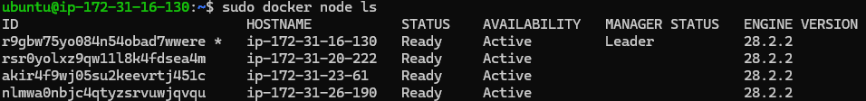
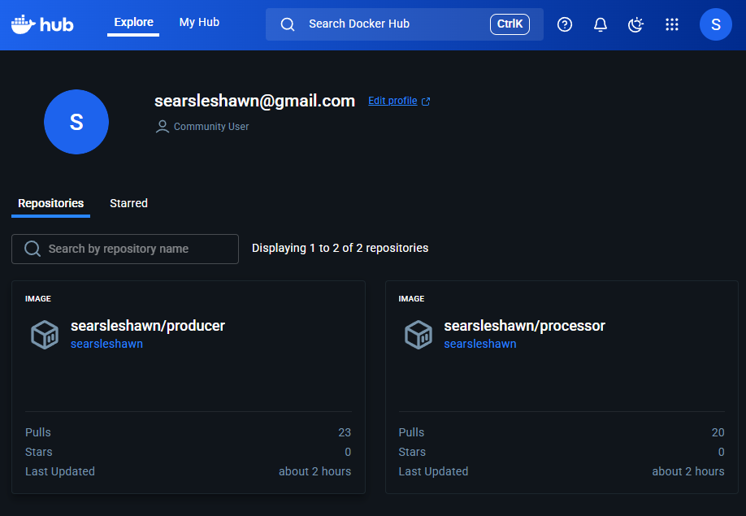
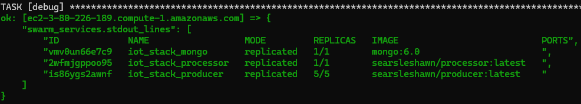
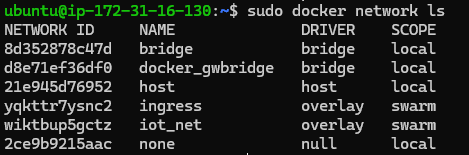
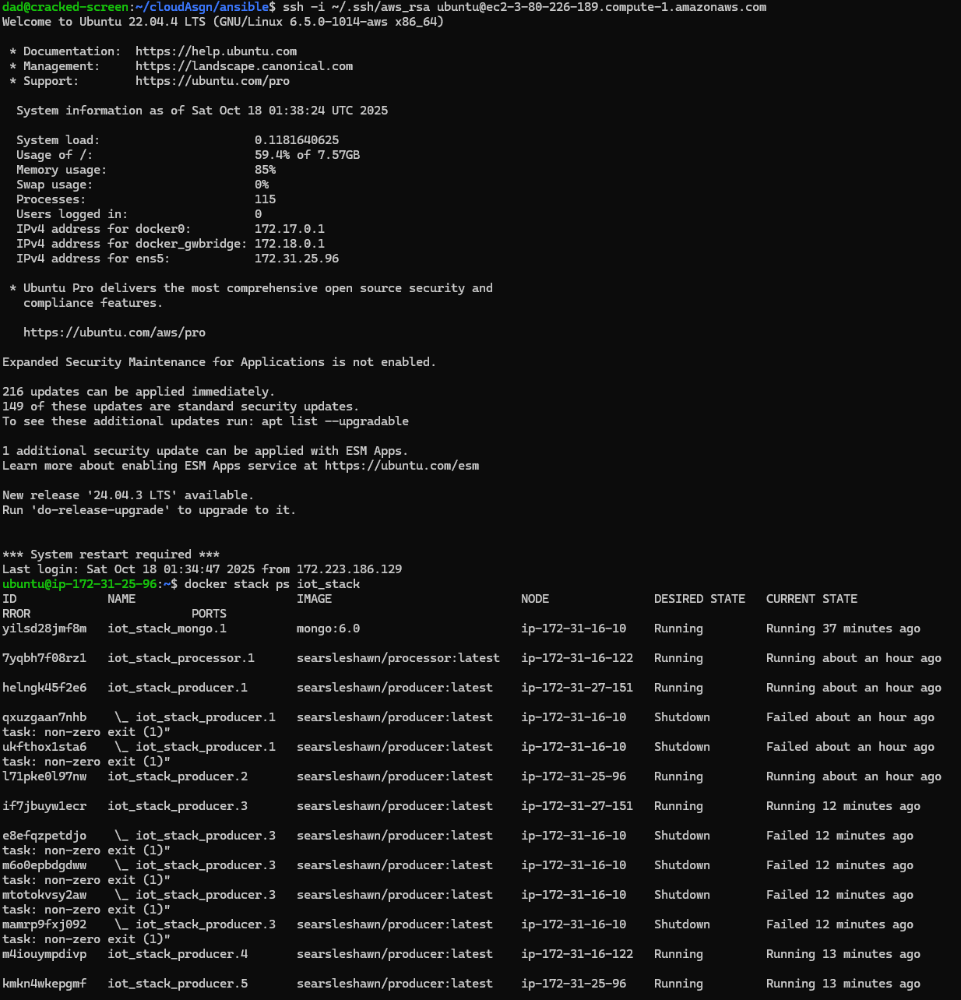
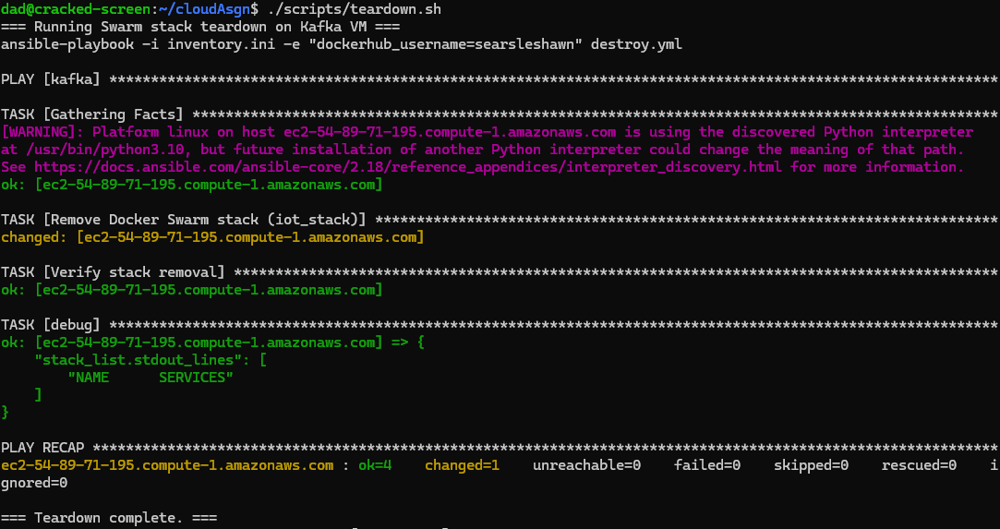
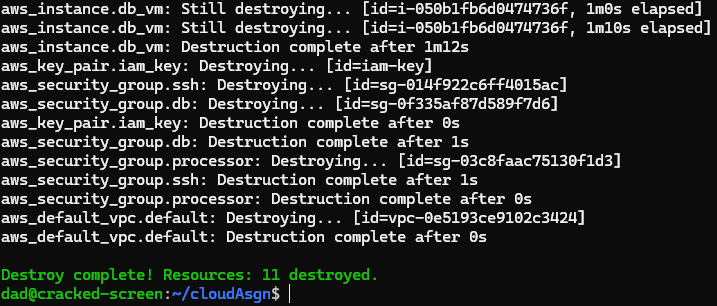
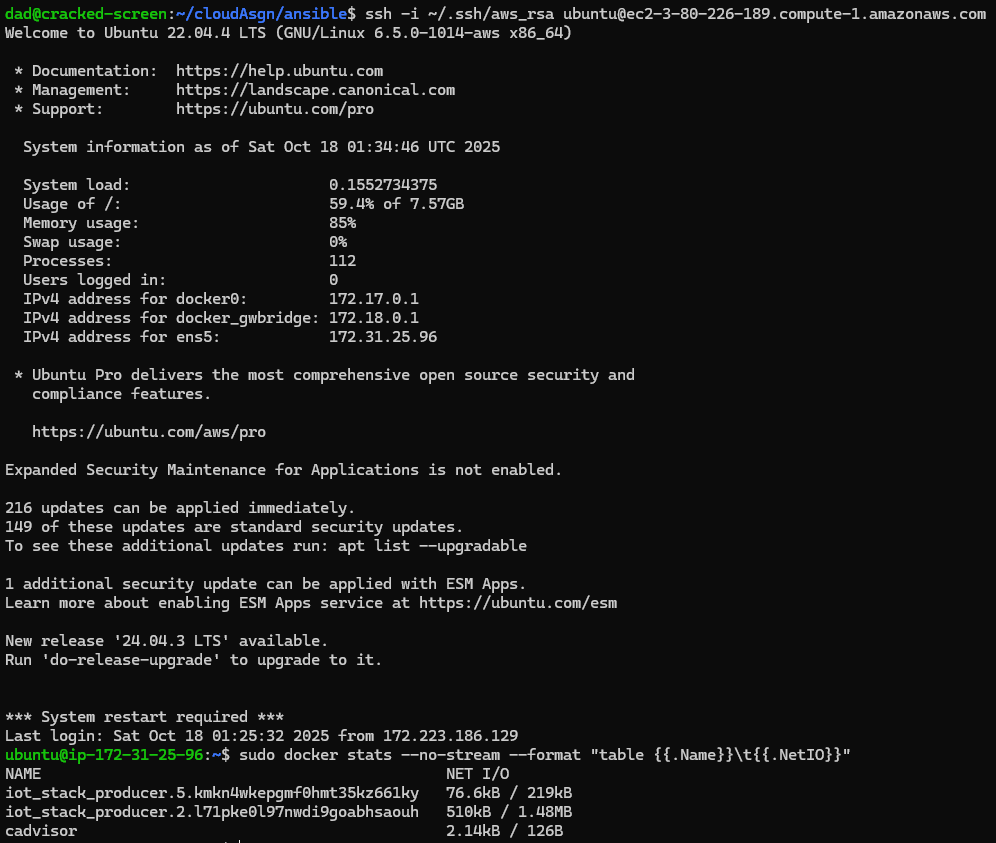

# 📘 README – CA2: Docker Swarm Orchestration for IoT Event Pipeline

## 1. Overview

This project extends the CA0/CA1 IoT pipeline into a Docker Swarm–based orchestrated platform.
It provisions infrastructure using Terraform, configures nodes with Ansible, and deploys the full event pipeline stack (Kafka, Zookeeper, Producer, Processor, and Database) declaratively through Swarm YAML templates.

The goal is to demonstrate:

- Declarative container orchestration

- Automated scaling and teardown

- Secure networking and access isolation

- Minimal manual configuration using Makefile automation

---

## 2. Architecture

### Pipeline Components
```
Producer  →  Kafka  →  Processor  →  MongoDB
```

### Infrastructure Flow
```
Terraform (AWS EC2) → Ansible (Node Config + Swarm Init) → Docker Stack Deploy
```

| Component       | Description                                                              |
| --------------- | ------------------------------------------------------------------------ |
| **Terraform**   | Provisions EC2 instances, networking, and SSH access                     |
| **Ansible**     | Configures Docker and initializes Swarm cluster                          |
| **Swarm Stack** | Deploys declarative services (Kafka, Zookeeper, Producer, Processor, DB) |
| **Scripts**     | Automate deployment (`deploy.sh`) and teardown (`teardown.sh`)           |
| **Makefile**    | Provides unified command automation for provisioning and deployment      |

---

## 3. Environment Setup

### Prerequisites

Terraform ≥ 1.6

Ansible ≥ 2.13

Docker Engine & Swarm mode

AWS CLI configured with valid credentials

SSH key ~/.ssh/aws_rsa available for EC2 provisioning

### Directory Structure
```
cloudAsgn/
├── terraform/
│   ├── main.tf
│   ├── outputs.tf
├── ansible/
│   ├── site.yml
│   ├── declaratives.yml
│   ├── destroy.yml
│   ├── vars/declarative.yml    # Update this file to dynamically adjust dockerhub user and replicas
│   ├── files/      # These files will need to be manually downloaded and placed in this directory here
│   │   ├── kafka_2.13-3.7.0.tgz
│   │   ├── mongodb-linux-x86_64-ubuntu2204-6.0.6.tgz
│   ├── templates/
│   │   ├── iot_stack.yml.j2
│   │   ├── processor.Dockerfile.j2
│   │   ├── producer.Dockerfile.j2
│   │   ├── processor.py.j2
│   │   ├── producer.py.j2
│   └── Makefile
├── scripts/
│   ├── deploy.sh
│   ├── teardown.sh
└── README.md
```

---

## 4. Makefile Automation and Deployment Scripts

The **Makefile** under `ansible/` defines the core Swarm lifecycle operations required by CA2:
- `make deploy` — runs `ansible-playbook site.yml` to deploy all services and perform smoke tests.
- `make destroy` — runs `ansible-playbook destroy.yml` to remove the Swarm stack and clean up.

These commands are wrapped by two top-level automation scripts for full orchestration of both infrastructure and application layers:

| Script | Description |
|---------|--------------|
| `scripts/deploy.sh` | Executes the full provisioning workflow: <br>  • Terraform init → plan → apply  <br>  • Exports Terraform outputs to `tf_outputs.json`  <br>  • Generates dynamic `inventory.ini` using `jq` for DNS-based host mapping  <br>  • Runs `make deploy` to launch all Swarm services |
| `scripts/teardown.sh` | Executes a complete teardown: <br>  • Runs `make destroy` to remove Swarm services  <br>  • Calls `terraform destroy` to deprovision EC2 instances and network resources |

**Usage**
```bash
# Full deployment (Terraform + Ansible + Docker Swarm)
./scripts/deploy.sh

# Full teardown and cleanup
./scripts/teardown.sh
```
---

## 5. Declarative Configuration

### All pipeline services are defined in `ansible/templates/iot_stack.yml.j2` (Docker Compose v3 format):

- **Kafka & Zookeeper**: Stateful services with internal networking

- **Processor & Producer**: Built via Jinja2-templated Dockerfiles

- **MongoDB**: Persistent backend service

- **Overlay Network**: Provides isolated communication among pipeline containers

### Cluster Overview

*Docker Swarm cluster showing 4 active nodes (1 manager, 3 workers) running Docker Engine 28.2.2.*


*Deployed Docker Hub repositories (`searsleshawn/producer` and `searsleshawn/processor`) used for declarative stack image sources.*


### Key declaratives:

- No hardcoded IPs — all host resolution uses Swarm overlay DNS.

- Secrets and environment variables managed in ansible/vars/declarative.yml.

## 6. Scaling Demonstration

The Swarm deployment supports fully declarative scaling and dynamic configuration through the file:
`ansible/vars/declarative.yml`.

This file contains key parameters such as:
- **`replicas`** – defines how many producer, processor, or database instances are deployed in the stack.
- **`docker_user`** – dynamically injects the Docker Hub username into all service definitions and image references.
- **`networks`** and other service-level variables – control the scope and internal connectivity of the overlay network.

Because these values are referenced directly in `iot_stack.yml.j2` through Jinja2 templating, **updating a variable in `vars/declarative.yml` automatically reconfigures the entire Swarm stack**.

To apply configuration or scaling changes, simply re-run the deployment target:
```bash
make deploy
```

### Scaling Verification

*Ansible debug output confirming scaling of Producer replicas (5/5) as defined in `vars/declarative.yml`.*


*Detailed view of Swarm tasks across nodes confirming balanced distribution and successful replica launch.*


## 7. Security & Access Controls
| Control                | Implementation                                                                                              |
| ---------------------- | ----------------------------------------------------------------------------------------------------------- |
| **Secrets Management** | All credentials are stored in **Ansible Vault** (`vars/secrets.yml`) and referenced securely in playbooks; no plaintext secrets appear in repository or logs |
| **Network Isolation**  | Custom overlay network in `iot_stack.yml.j2` restricting external exposure                                  |
| **Minimal Ports**      | Only Kafka and DB ports published externally                                                                |
| **SSH Key Auth**       | `aws_rsa` key enforced for Ansible connections                                                              |
| **Role Separation**    | Managers vs workers in Swarm cluster                                                                        |

**Vault Integration Notes**

- Sensitive variables (e.g., `mongo_username`, `mongo_password`, `dockerhub_token`) are encrypted in `ansible/vars/secrets.yml` using **Ansible Vault**.  
- Playbooks reference these variables securely:

  ```yaml
  MONGO_INITDB_ROOT_USERNAME={{ mongo_username }}
  MONGO_INITDB_ROOT_PASSWORD={{ mongo_password }}
  ```



*Custom overlay network (`iot_net`) ensuring restricted communication between internal pipeline services.*

⚠️ Note: `ansible/vars/secrets.yml` has been excluded for security reasons.  
Before deployment, create a local version with your own credentials or use an Ansible Vault file.  


## 8. Validation & Smoke Testing

Smoke Test Objective: verify end-to-end event flow.
Run after full deployment:

``` bash
make deploy
# OR
bash scripts/deploy.sh
```

Checks performed:

- Producer sends sample events to Kafka
- Processor consumes and writes to MongoDB
- Logs show successful end-to-end data flow


*Docker Swarm stack (`iot_stack`) showing running MongoDB, Processor, and multiple Producer replicas.*

## 9. Teardown and Cleanup

After successful validation:

```
make destroy
# or
bash scripts/teardown.sh
```
This removes:

- Swarm stack and overlay networks
- Ansible-configured Docker services
- All Terraform-provisioned AWS instances and resources (only when using `scripts/teardown.sh`)



*Docker Swarm stack (`iot_stack`) shown being removed using make destroy*


*Fully completed teardown process completed*

## 10. Observability & Metrics

Metrics can be collected via:

- docker stats for container CPU/memory usage
- docker service ps iot_producer for scaling observation
- Optional Prometheus/Grafana integration (future extension)


*Live network I/O statistics (`docker stats`) showing Producer containers transmitting data across the Swarm network.*


## 11. Deliverables Summary
| Category            | File/Output                                                                               |
| ------------------- | ----------------------------------------------------------------------------------------- |
| Infrastructure      | `terraform/main.tf`, `terraform/outputs.tf`                                               |
| Configuration       | `ansible/site.yml`, `ansible/declaratives.yml`                                            |
| Templates           | `ansible/templates/iot_stack.yml.j2`, `producer.Dockerfile.j2`, `processor.Dockerfile.j2` |
| Scripts             | `scripts/deploy.sh`, `scripts/teardown.sh`                                                |
| Automation          | `Makefile`                                                                                |
| Documentation       | `README.md`                                                                               |
| Validation Evidence | Screenshots of `docker stack ps`, scaling tests, and metrics                              |

## 12. Updates over CA1 and path to completion

The IoT pipeline detailed in this `README` builds upon the work of CA1 reusing much of what was created for that infrastructure. To utilize Docker Swarm and orchestrate this cloud network as PaaS some notable suggestions and changes were needed to be made.

### Notable Changes/Decisions:
- Due to the nature of my system the consideration of an S3 bucket was considered but since this service is hosted on my 24/7 home server with maximum and ease of direct access it is much more stable than using an S3 bucket as the experienced zombie node creation outbreak experienced during development. But if the need for additional scalability is needed than this adds minimal value to IoT pipeline.

- Kuberbetes was also explored but due to the use of ansible within CA1, using kubernetes would have made most of the pre-existing infrastructure no longer viable, this led to the decision of using Docker Swarm.

-  When building this new CA2 infrastructure, Most all modifications were able to be simply added through the use of docker swarm with slight updates to the networking within terraform's main.tf file used to create the VPC instances. This also included several changes to the ansible site.yml structure with the inclusion of other necessary items to create the iot_stack used in this Docker Swarm stack.

- Automation reuses pre-existing script commands combined with updated Makefile commands that strictly execute commands in relation to the Swarm stack gracefully.
